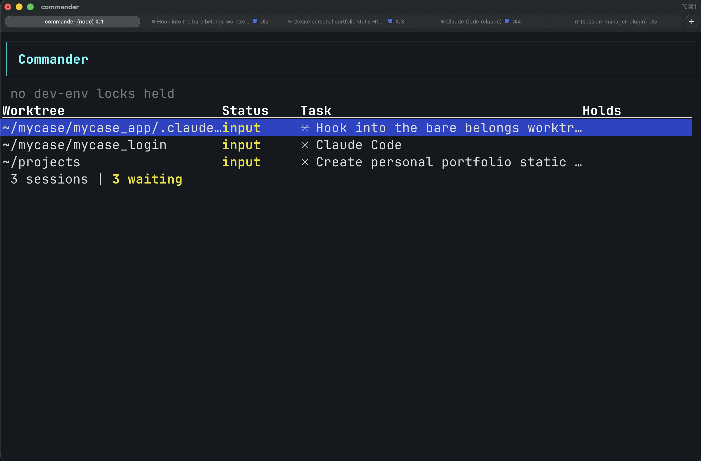

# Commander

Vim-motion TUI for humans + a skill for the agents.

Born from wanting multiple Claude Code sessions running in parallel without mentally tracking which one is on which branch or whose turn it is to hit the containers. Each session lives in its own git worktree, but only one branch's code can run in the shared dev-env containers at a time.

Commander is two surfaces:

- A vim-motion TUI where human can see every session's status and reply to whichever is blocked on input.
- A Claude Code skill ([`SKILL.md`](./SKILL.md)) that tells the sessions themselves when to `take` and `release` the lock.

The worktrees themselves are Claude Code's native `EnterWorktree` — a new session is instructed to create or attach to a worktree at `<repo>/.claude/worktrees/<branch>`. Commander doesn't create worktrees; it coordinates the shared dev-env container stack across the ones Claude has already made.



## Features

- **CLI** — `take` / `release` / `steal` / `status` / `register`, called by agents from their Bash tool
- **TUI** — live view of every Claude session grouped by worktree, blocked-on-input highlighted, lock holders pinned up top
- **Registry** — per-repo main path + rebuild command in `~/.claude/commander/registry.json`; add repos with `commander register`
- **PID liveness** — stale locks (holder crashed) auto-cleared on next `take`
- **iTerm2 integration** — jump to a session's tab, preview its buffer, send text or menu answers back without leaving commander

## Install

Requires Node 20+, macOS, and iTerm2 (`brew install --cask iterm2` — used for tab focus and buffer capture via AppleScript).

```bash
git clone https://github.com/senorale/commander.git ~/projects/commander
cd ~/projects/commander
make install
```

Installs a shim at `~/.local/bin/commander` — add to PATH if needed:

```bash
echo 'export PATH="$HOME/.local/bin:$PATH"' >> ~/.zshrc
```

## Register your repos

Registry lives at `~/.claude/commander/registry.json`. Add each repo with its main worktree path and rebuild command:

```bash
commander register my_repo \
  --main ~/code/my_repo \
  --rebuild docker compose -f ~/code/my_repo/docker-compose.yml up --build -d \
  --base main
```

`--rebuild` takes an argv list (everything after the flag). Point it at whatever spins up your dev env on the current branch. `--base` is the branch to return to on `release` (defaults to `develop`). Register as many repos as you want — each gets its own lock file.

## Usage

For humans:

```bash
commander              # launch TUI (same as `commander view`)
commander status       # quick text status
```

For agents, from a Claude session's Bash tool:

```bash
commander take             # before hitting containerized code
commander take --no-push   # use local committed branch, skip origin push
commander release          # when done
```

The shipped [`SKILL.md`](./SKILL.md) is a generic template. **Recommendation: don't drop it in verbatim — write a repo-specific version** at `~/.claude/skills/commander/SKILL.md` (or per-repo `<repo>/.claude/skills/commander/SKILL.md`) that names your actual repos, containers, and rebuild command, with YES / NO example lists in your own commands (e.g. `docker compose exec front bin/rails test ...`) and trigger phrases matching how you actually ask for things. A tailored skill fires reliably; a generic one gets ignored. Commander is only useful if agents actually call it.

## TUI keybindings

Standard vim motions (`j` / `k` / `gg` / `G` / `Ctrl-U` / `Ctrl-D`) for nav in the table and scroll in the preview.

| Key | Action |
|-----|--------|
| `Enter` | Open selected session's iTerm buffer in preview |
| `Esc` | Close input box, or leave preview back to the table |
| `i` | Open input box; type + Enter sends to the session's tty |
| `t` | Jump to that session's iTerm tab |
| `r` | Release the lock on the selected row's repo |
| `s` | Steal the lock (refuses if main worktree is dirty) |
| `R` | Force refresh |
| `Ctrl+C` | Clear input box (only when open) |
| `q` / `Ctrl+Q` | Quit |

## Lock lifecycle

`commander take` from worktree `~/code/my_repo-featureX` on branch `featureX`:

1. Detect repo (`my_repo`) via `git rev-parse --git-common-dir`
2. Refuse if the worktree has uncommitted changes
3. `git push origin featureX` (skipped with `--no-push`)
4. `git checkout --detach` in the worktree (releases the branch grip)
5. Write `~/.claude/commander/my_repo.lock` with holder metadata
6. In main: check out the remote branch (or the local committed branch with `--no-push`)
7. Run the repo's `rebuild_cmd`

`commander release`:

1. Verify caller's session/pid matches the lock holder
2. In main: `git checkout <original_base>`
3. In the original worktree: `git checkout <branch>` (reattach)
4. Delete the lock file

Stale locks (holder pid dead) are detected via `kill(pid, 0)` and auto-cleared by the next `take`.

## Tech stack

- [Ink 5](https://github.com/vadimdemedes/ink) — React for the terminal
- [commander](https://github.com/tj/commander.js) — CLI parsing
- [execa](https://github.com/sindresorhus/execa) — subprocess wrangler
- [proper-lockfile](https://github.com/moxystudio/node-proper-lockfile) — filesystem lock primitive
- git CLI — worktree / checkout / reset / push
- AppleScript — iTerm2 tab focus + buffer capture + text send-back

## Theming

Commander respects your terminal's color scheme — named colors resolve through your iTerm profile, so a light-mode iTerm just works. Two built-in themes plus a config file:

- `--theme default` — colored, uses terminal palette
- `--theme mono` — no colors, emphasis via bold/underline (accessibility / colorblind-safe)

Resolution priority (highest wins):

1. `--theme <name>`
2. `$COMMANDER_THEME` env var
3. `~/.config/commander/theme.json` (or `$XDG_CONFIG_HOME/commander/theme.json`)
4. Built-in `default`

Config is a partial override, optionally extending a built-in:

```json
{
  "extends": "default",
  "selectedBg": "magenta",
  "approval": "#ff5555",
  "input": "yellow",
  "useDim": false
}
```

Semantic tokens: `primary`, `primaryBorder`, `selectedBg`, `lockHeld`, `lockStale`, `running`, `input`, `approval`, `info`, `warn`, `error`, `inputBorder`, `inputChevron`, `useBold`, `useUnderline`, `useDim`. Values are Ink color names or hex.
